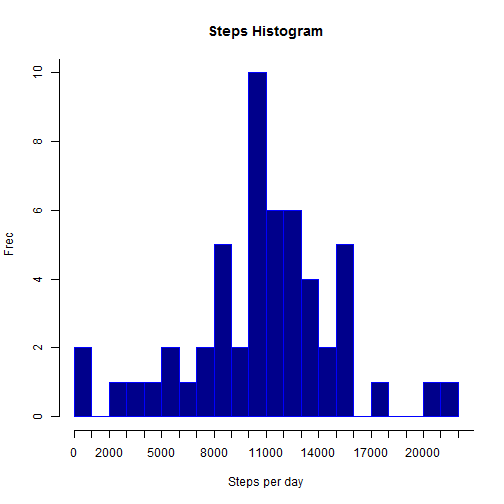
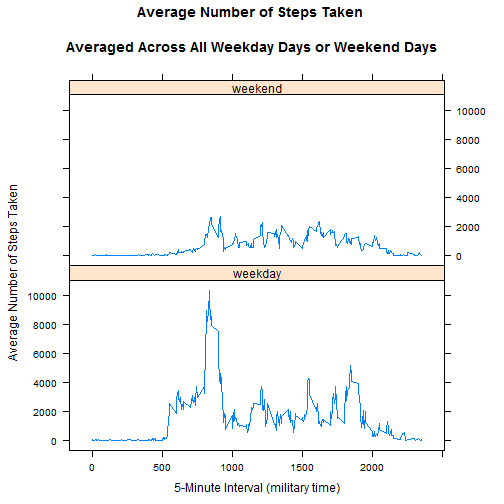

----------------------------------
Peer Assignment 1
----------------------------------
## Charging necessaries libraries

```r
library(knitr)
library(dplyr)
library(chron)
library(reshape2)
library(lattice)
```

## Loading and preprocessing the data

Dowload file from link provided by course ([Activity monitoring data](https://d396qusza40orc.cloudfront.net/repdata%2Fdata%2Factivity.zip)) into temporal directory and unzip it in the working directory.


```r
fileURL<-"https://d396qusza40orc.cloudfront.net/repdata%2Fdata%2Factivity.zip"
temp <- tempfile()
setInternet2() #Active connections
download.file(fileURL,temp)
unzip(temp)
unlink(temp)
```

Load into a data table


```r
Data<-read.csv("activity.csv")
Data_NA_removed<-na.omit(Data)
```

Process data, modify table shape to get the info necessary

```r
reshaped_Data<-melt(Data_NA_removed,id=c("date","interval"),measure.vars="steps")
```


## What is mean total number of steps taken per day?

1. Total number of steps per day

```r
steps_per_day<-dcast(reshaped_Data,date~variable,sum)
number_of_steps<-sum(steps_per_day$steps)
```

The number of steps are 570608

2. Histogram of steps per day
  

```r
histogram<-hist(steps_per_day$steps, plot=F,breaks=30)
plot(histogram,col="darkblue",border="blue",main="Steps Histogram",xlab="Steps per day",ylab="Frec",
               ylim=NULL,xaxt='n',yaxt='n')
axis(side=2, at=seq(0,32, 2), labels=T)
axis(side=1, at=seq(0,25000, 1000), labels=T)
```

 

3. Mean and median of steps per day.
 

```r
mean_steps<-mean(steps_per_day$steps,na.rm=T)
median_steps<-median(steps_per_day$steps,na.rm=T)
```
 
The mean of steps per day is 10766.19 steps.

The median of steps per day is 10765 steps.

## What is the average daily activity pattern?

1.Time series plot.


```r
steps_per_interval<-dcast(reshaped_Data,interval~variable,sum)
plot(steps_per_interval$interval,steps_per_interval$steps,type = "l", main="Daily activity pattern", xlab=
       "5 minutes interval", ylab="Mean of number of steps",col="dark blue")
```

 


```r
interval_max_steps_number<-steps_per_interval[steps_per_interval$steps %in% 
                                                max(steps_per_interval$steps),]$interval
```

2.The interval with maximun mean of steps is the interval number 835.

## Imputing missing values


```r
NA_number<-sum(is.na(Data))
```

1.There exists 2304 missing values

2.Missing values changed by mean value of the interval

```r
median_per_interval<-dcast(reshaped_Data,interval~variable,mean)
NA_values <- numeric()
for (i in 1:nrow(Data)) {
    obs <- Data[i, ]
    if (is.na(obs$steps)) {
        steps <- subset(median_per_interval, interval == obs$interval)$steps
    } else {
        steps <- obs$steps
    }
    NA_values<- c(NA_values, steps)
}
```

3.New dataset created with missing values filled in.

```r
Data_NA_filled<-Data
Data_NA_filled$steps<-NA_values
```
4. Creating an histogram.

```r
reshape_NA_filed_data<-melt(Data_NA_filled,id=c("date","interval"),measure.vars="steps")
steps_per_day_NA_filled<-dcast(reshape_NA_filed_data,date~variable,sum)
histogram<-hist(steps_per_day_NA_filled$steps, plot=F,breaks=30)
plot(histogram,col="darkblue",border="blue",main="Steps Histogram",xlab="Steps per day",ylab="Frec",
               ylim=NULL,xaxt='n',yaxt='n')
axis(side=2, at=seq(0,32, 2), labels=T)
axis(side=1, at=seq(0,25000, 1000), labels=T)
```

 


```r
mean_steps_NA_filled<-mean(steps_per_day_NA_filled$steps)
median_steps_NA_filled<-median(steps_per_day_NA_filled$steps)
total_steps_NA_filled<-sum(steps_per_day_NA_filled$steps)
```
 
The mean of steps per day is 10766.19 steps.

The median of steps per day is 10766.19 steps.

There is no modification in the mean but the median has taken the value from the mean.

The total daily number of steps has raised till 656737.5 steps.

## Are there differences in activity patterns between weekdays and weekends?

1. Create a factor varible to indicate if the date is from a weekday or a weekend.


```r
Data_NA_filled$Weekend=ifelse(is.weekend(Data_NA_filled$date),"weekend","weekday")
reshape_NA_filed_data_weekend<-melt(Data_NA_filled,id=c("date","interval","Weekend"),measure.vars="steps")
```

2.Make a panel plot containing a time series for weekdays and other one for weekdays.

```r
steps_per_interval_NA_filled<-dcast(reshape_NA_filed_data_weekend,interval+Weekend~variable,sum)
xyplot(steps ~ interval | factor(Weekend), data=steps_per_interval_NA_filled, 
       type = 'l',
       layout=c(1,2),
       main="Average Number of Steps Taken 
       \nAveraged Across All Weekday Days or Weekend Days",
       xlab="5-Minute Interval (military time)",
       ylab="Average Number of Steps Taken")
```

 

